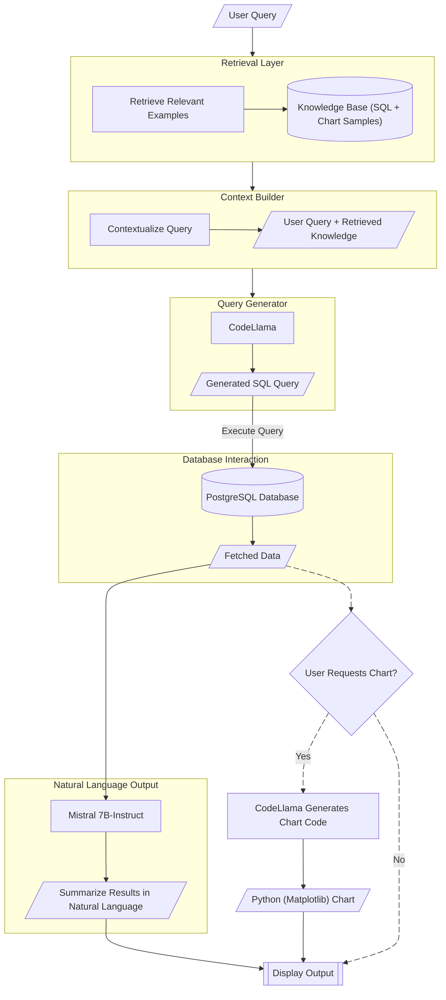
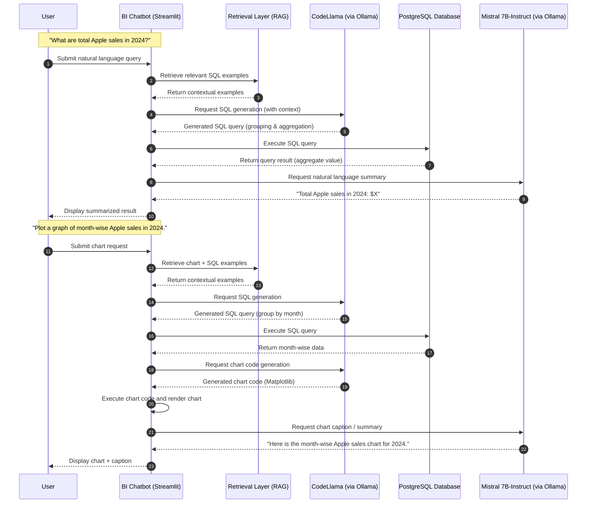

# 🧠 NL2SQL Business Intelligence Chatbot

[]()
[]()
[]()
[]()


### Transform Natural Language into Actionable Business Insights

The **NL2SQL BI Chatbot** is an intelligent **Business Intelligence assistant** that enables users to interact with databases using **natural language**.  
By combining the power of **Ollama-hosted Large Language Models (LLMs)** with a **RAG-like (Retrieval-Augmented Generation) architecture**, the chatbot translates user questions into **SQL queries**, executes them on a **PostgreSQL** database, and returns insights in both textual and visual form.

Whether you’re asking for a sales report, data trend, or chart visualization — the chatbot simplifies complex analytics into an intuitive conversational experience.

---

## 🚀 Key Features

- 🗣 **Natural Language Querying**  
  Ask questions like:  
  > *"Show me the total revenue by region in 2024."*  
  The chatbot generates the corresponding SQL query, executes it, and displays the results.

- 🧠 **Dual-Model Intelligence (Ollama Integration)**  
  - **CodeLlama** → For generating accurate SQL queries and Python chart code.  
  - **Mistral:7B-Instruct** → For generating natural language responses and summaries.

- 🧩 **RAG-Like Architecture for Contextual Understanding**  
  The chatbot uses a **retrieval-augmented approach** by maintaining a **knowledge base** of:
  - Example **SQL queries** demonstrating database patterns.  
  - Example **Python chart codes** (e.g., Matplotlib, Plotly) for visualizations.  
  These examples are retrieved and provided as **context** to the LLM before query generation — improving accuracy, consistency, and adaptability.

- 🗄 **PostgreSQL Database Connectivity**  
  Seamless connection to PostgreSQL for real-time data querying and analytics.

- 📁 **Excel & CSV Data Upload**  
  Upload `.xlsx` or `.csv` files, and the application automatically loads them into the PostgreSQL database.

- 📊 **Automatic Visualization**  
  On user request, the chatbot generates and displays relevant charts (bar, line, pie, etc.) using the data fetched from SQL queries.

- 💬 **Conversational BI Assistant**  
  For greetings, summaries, or non-database queries, the chatbot replies naturally using **Mistral:7B-Instruct**.

- 💡 **Streamlit Frontend Interface**  
  Built using Streamlit, ensuring an elegant, interactive, and user-friendly interface.

---

## 🧠 Language Models Used

### 🧩 Ollama’s CodeLlama
- **Purpose:** SQL and Python chart code generation  
- **Why Chosen:**  
  - Designed specifically for programming and structured data manipulation.  
  - Excellent understanding of **SQL syntax**, schema context, and query optimization.  
  - Capable of producing **data visualization code snippets** using libraries like Matplotlib or Plotly.

### 💬 Ollama’s Mistral:7B-Instruct
- **Purpose:** Handles conversational tasks, summaries, and non-database-related queries.  
- **Why Chosen:**  
  - Superior natural language understanding and response generation.  
  - Ideal for **explaining query results** and managing user interaction flow.  
  - Efficient on local inference with Ollama.

---

## 🧩 RAG-Like Knowledge Architecture

The chatbot implements a **RAG-inspired pipeline** to enhance LLM reliability and contextual accuracy:



---

## 🔄 Query Flow: From Natural Language to Insights

The diagram below illustrates how the **NL2SQL Business Intelligence Chatbot** processes user requests — from natural language input to SQL generation, execution, visualization, and natural language summarization.

Two example interactions are shown:

> Analytical Query – “What are total Apple sales in 2024?”

> Visualization Query – “Plot a graph of month-wise Apple sales in 2024.”




---

## 🖥️ Screenshots
Below are sample outputs from the chatbot interface, showcasing **query responses** and **automatic chart generation**:

> Plot a line chart of month-wise Apple vs Samsung sales in 2024.

| Query Result | Chart Visualization |
|--------------|---------------------|
|  |  |

---

## 📦 Installation & Setup

1. **Clone the Repository**
  ```bash
  git clone https://github.com/TUSHAR-S-KALE/nl2sql-bi-chatbot.git
  cd nl2sql-bi-chatbot
  ```

2. **Create a Virtual Environment**
  ```bash
  python -m venv BIVenv
  BIVenv\Scripts\activate    # For Windows
  # source BIVenv/bin/activate   # For macOS/Linux
  ```

3. **Install Dependencies**
  ```bash
  pip install -r requirements.txt
  ```

4. **Run Ollama and Pull Models**
  ```bash
  ollama pull codellama
  ollama pull mistral:7b-instruct
  ```

5. **Launch the Application**
  ```bash
  streamlit run app.py
  ```

6. **Configure the Database**

- Make sure you have PostgreSQL installed and running.

- You can either:

  - Connect to an existing PostgreSQL database by providing credentials in the app interface, or

  - Upload .csv or .xlsx files to let the application automatically create tables in the database.

💡 Tip: Make sure Ollama is running in the background before launching the app — this enables CodeLlama and Mistral:7B-Instruct to process your queries and responses.

---

## 🧮 Usage

### 1. Connect to Database
- Select **PostgreSQL** and provide your connection credentials.  
- Alternatively, upload **`.csv`** or **`.xlsx`** files — the application will automatically import them into the database for querying.

### 2. Ask a Question
You can interact with the chatbot using **natural language queries**.

**Examples:**
```text
"Show the top 10 products by sales in 2023."
"Plot a bar chart of monthly profits."
"Summarize total revenue by category."
```

### 3. View Results and Charts

Once you submit a query, the chatbot will:

- 🧠 **Generate an SQL query** using **CodeLlama**  
- 🗄️ **Execute the query** on the connected **PostgreSQL** database  
- 📊 **Visualize the data** with a chart *(if requested)*  
- 💬 **Summarize results** in natural language using **Mistral:7B-Instruct**

---

## 🧠 Technologies Used

| **Category** | **Tools / Libraries** |
|---------------|-----------------------|
| **Frontend** | Streamlit |
| **Language Models** | Ollama’s **CodeLlama** *(SQL & chart generation)*, Ollama’s **Mistral:7B-Instruct** *(response generation, summarization)* |
| **Architecture** | RAG-like *(Knowledge base of SQL and chart examples)* |
| **Database** | PostgreSQL |
| **Visualization** | Matplotlib |
| **LLM Hosting** | Ollama *(Local inference environment)* |

---

## 🧾 License
This project is licensed under the **MIT License**.  
Feel free to use, modify, and distribute with attribution.
